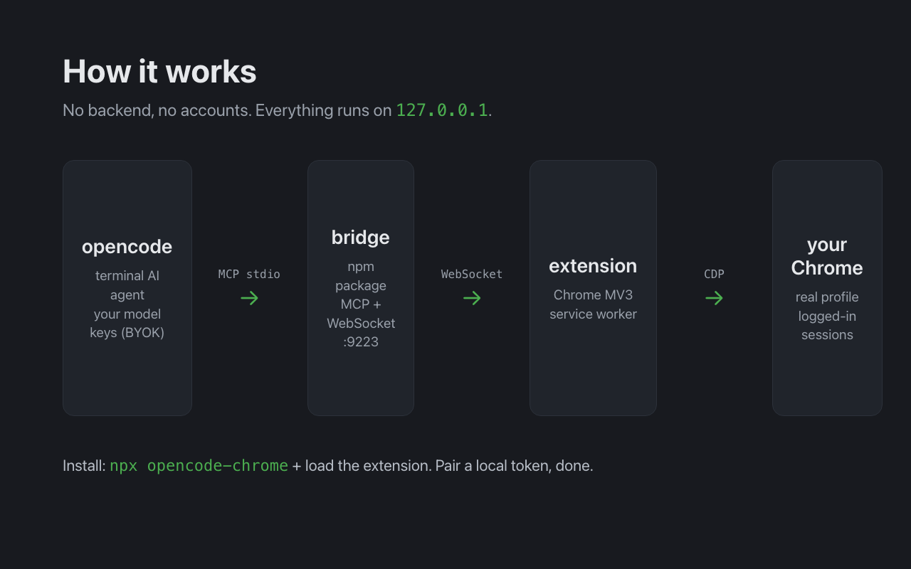

# opencode-chrome

[](https://www.npmjs.com/package/opencode-chrome)
[](https://github.com/G10hdz/opencode-chrome/actions/workflows/ci.yml)
[](LICENSE)

opencode-chrome lets [opencode](https://opencode.ai) use your real Chrome: the
one already logged into Gmail, your dashboards, your staging site. Ask in the
terminal, watch it happen in your browser. An unofficial, community-built
bridge in the spirit of Claude in Chrome / Codex in Chrome.

<p align="center">
  
</p>

> **Unofficial.** Not affiliated with or endorsed by the opencode project.
> BYOK: your model keys stay in your opencode config. This bridge collects
> nothing and talks only to localhost.

## What it looks like

```
you ▸ open github.com/notifications and tell me which repos have unread activity
you ▸ click the extension icon to attach that tab
opencode ▸ snapshot  (reads the list as a text tree)
           → acme/api (2), acme/web (1), infra/deploy (5)

you ▸ go to the staging checkout and screenshot it
opencode ▸ navigate    staging.example.com/checkout
           screenshot  → returns the PNG
```

It works because it drives *your* browser session, so anything you can see
while logged in, the agent can see too.

## How it works

A tiny local bridge (`npx opencode-chrome`, an MCP server plus a WebSocket on
`127.0.0.1:9223`) and an MV3 extension that connects to it and drives only the
tabs you attach from the toolbar, using the Chrome DevTools Protocol. An
attachment is limited to the tab's current origin. No backend, no accounts,
no analytics.

## Requirements

- Node 18 or newer
- Google Chrome (or Chromium)
- opencode (or any MCP client that launches a local stdio server)

## Install

**1. Extension:** download the repo (or the [latest
release](../../releases)), open `chrome://extensions`, enable Developer
mode, "Load unpacked", select the `extension/` folder. The toolbar badge
shows `off` until the token is configured and the bridge is running.

**2. Bridge:** add to your opencode config (`opencode.json`):

```json
{
  "mcp": {
    "chrome": { "type": "local", "command": ["npx", "-y", "opencode-chrome"] }
  }
}
```

**3. Pair the token:** the bridge generates a token at
`~/.config/opencode-chrome/token` (or prints it to stderr and copies it to
your clipboard at startup; set `OPENCODE_CHROME_TOKEN` to use your own).
Paste it into the extension's options page (right-click the toolbar icon →
Options); it shows a live connection status and reconnects the moment you
save. Connections without this token are refused, so other local processes
can't drive your browser.

**4. Attach a tab:** restart opencode, open the page you want to share, and
click the extension icon. Its badge shows `on` for attached tabs. Cross-origin
navigation detaches the tab, so attach it again before continuing.

## Tools

| Tool | What it does |
|---|---|
| `browser_status` | bridge connection and attached tabs |
| `list_tabs` | attached tabs with id, title, url |
| `new_tab(url?)` | open a tab (active) |
| `close_tab(id)` / `activate_tab(id)` | tab management |
| `navigate(url, tabId?)` | navigate and wait for load |
| `snapshot(tabId?)` | accessibility-style text tree with `[ref]` per interactive element |
| `click(ref)` | resolve ref and click |
| `type(ref, text)` | focus + type; trailing `\n` = Enter |
| `screenshot(tabId?)` | PNG (base64) |
| `wait_for(text, timeout?)` | poll page text until it appears |

## Notes

- While the agent acts, Chrome shows the "being debugged" banner. That is
  expected with CDP; the extension auto-detaches after 30s idle.
- Env vars for the bridge: `OPENCODE_CHROME_PORT` (default 9223, extension
  expects the default), `OPENCODE_CHROME_TIMEOUT_MS` (default 30000).
- Security: the WebSocket binds to 127.0.0.1 only, rejects non-extension
  origins, and requires the shared bridge/extension token. The only data
  stored persistently is that token (in `chrome.storage.local`). Attached tab
  origins live only in `chrome.storage.session`. Page content never leaves
  your machine through this bridge; it goes only to your model provider,
  exactly like any opencode prompt.

## Troubleshooting

- **Badge stays `off`:** the extension is not connected. Check that the
  bridge is running (opencode launches `npx opencode-chrome`; its stderr
  prints the token at startup) and that the token in the options page
  matches. The options page shows the connection status live.
- **A tool returns "Chrome extension not connected":** same causes as
  above; the bridge is up but no extension has paired.
- **`cannot listen on 127.0.0.1:9223`:** another process holds the port.
  Free it, or set `OPENCODE_CHROME_PORT`. The extension expects 9223, so a
  custom port also needs editing `PORT` in `extension/background.js`.
- **`debugger attach` fails:** a tab allows only one debugger client. Close
  DevTools on that tab (or detach other debuggers) and retry.

## Development

```bash
npm install
npm test        # bridge tests (node:test, no Chrome needed)
npm run pack    # builds dist/opencode-chrome-<version>.zip for CWS upload
```

Icons live in `extension/icons/`, sized from the 1024px masters in `assets/`:
`sips -z <size> <size> assets/logo-1024-transparent.png --out extension/icons/icon<size>.png`.

Contributions welcome: see [CONTRIBUTING.md](CONTRIBUTING.md). Working on the
code with an AI agent? Start with [AGENTS.md](AGENTS.md).

MIT license. See [LICENSE](LICENSE).

---

# opencode-chrome (español)

opencode-chrome deja que [opencode](https://opencode.ai) use tu Chrome real:
el que ya tiene la sesión iniciada en Gmail, tus dashboards, tu staging.
Pídelo en la terminal y pasa en tu navegador. Puente comunitario no oficial,
al estilo de Claude in Chrome / Codex in Chrome.

> **No oficial.** Sin afiliación con el proyecto opencode. BYOK: tus keys
> viven en tu config de opencode. Este puente no recolecta nada y solo se
> comunica con localhost.

## Cómo se ve

```
tú ▸ abrí github.com/notifications y decime qué repos tienen actividad sin leer
opencode ▸ navigate  github.com/notifications
           snapshot  (lee la lista como árbol de texto)
           → acme/api (2), acme/web (1), infra/deploy (5)

tú ▸ andá al checkout de staging y sacale un screenshot
opencode ▸ navigate    staging.example.com/checkout
           screenshot  → devuelve el PNG
```

Funciona porque maneja *tu* sesión del navegador: lo que ves con la sesión
iniciada, el agente también lo ve.

## Cómo funciona

Un puente local chico (`npx opencode-chrome`, servidor MCP más un WebSocket en
`127.0.0.1:9223`) y una extensión MV3 que se conecta a él y controla solo las
pestañas que adjuntas desde el ícono, mediante Chrome DevTools Protocol. Sin
backend, sin cuentas, sin analítica.

## Requisitos

- Node 18 o superior
- Google Chrome (o Chromium)
- opencode (o cualquier cliente MCP que lance un servidor stdio local)

## Instalación

1. **Extensión**: `chrome://extensions` → modo desarrollador → "Cargar
   descomprimida" → carpeta `extension/` del repo. El badge muestra `off`
   hasta configurar el token y correr el puente.
2. **Puente**: en tu `opencode.json`:
   ```json
   { "mcp": { "chrome": { "type": "local", "command": ["npx", "-y", "opencode-chrome"] } } }
   ```
3. **Token**: el puente genera uno en `~/.config/opencode-chrome/token` (o lo
   imprime por stderr y lo copia a tu portapapeles al arrancar;
   `OPENCODE_CHROME_TOKEN` para usar el tuyo). Pegalo en la página de
   opciones de la extensión (click derecho en el ícono → Opciones); muestra
   el estado de conexión y reconecta apenas guardás. Sin ese token, las
   conexiones se rechazan.
4. Reinicia opencode, abre la página, haz clic en el ícono de la extensión para
   adjuntar esa pestaña y luego pídele cosas.

Herramientas, notas de seguridad, solución de problemas y desarrollo: ver
sección en inglés arriba (mismo contenido). Para contribuir:
[CONTRIBUTING.md](CONTRIBUTING.md); si trabajas con un agente de IA:
[AGENTS.md](AGENTS.md).
