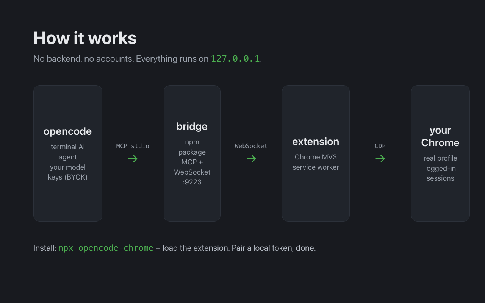

# opencode-chrome

[](https://www.npmjs.com/package/opencode-chrome)
[](https://github.com/G10hdz/opencode-chrome/actions/workflows/ci.yml)
[](LICENSE)

opencode-chrome lets [opencode](https://opencode.ai) use your real Chrome: the
one already logged into Gmail, your dashboards, your staging site. Ask in the
terminal, watch it happen in your browser. An unofficial, community-built
bridge in the spirit of Claude in Chrome / Codex in Chrome.

<p align="center">
  
</p>

> **Unofficial.** Not affiliated with or endorsed by the opencode project.
> BYOK: your model keys stay in your opencode config. This bridge collects
> nothing and talks only to localhost.

## What it looks like

```
you ▸ open github.com/notifications and tell me which repos have unread activity
you ▸ click the extension icon to attach that tab
opencode ▸ snapshot  (reads the list as a text tree)
           → acme/api (2), acme/web (1), infra/deploy (5)

you ▸ go to the staging checkout and screenshot it
opencode ▸ navigate    staging.example.com/checkout
           screenshot  → returns the PNG
```

It works because it drives *your* browser session, so anything you can see
while logged in, the agent can see too.

## How it works

A tiny local bridge (`npx opencode-chrome`, an MCP server plus a WebSocket on
`127.0.0.1:19223`) and an MV3 extension that connects to it and drives only the
tabs you attach from the toolbar, using the Chrome DevTools Protocol. An
attachment is limited to the tab's current origin. No backend, no accounts,
no analytics.

## Requirements

- Node 18 or newer
- Google Chrome (or Chromium) 116 or newer
- opencode (or any MCP client that launches a local stdio server)

## Install

**1. Extension:** download the repo (or the [latest
release](../../releases)), open `chrome://extensions`, enable Developer
mode, "Load unpacked", select the `extension/` folder. The toolbar badge
shows `off` until the token is configured and the bridge is running.

**2. Bridge:** add to your opencode config (`opencode.json`):

```json
{
  "mcp": {
    "chrome": { "type": "local", "command": ["npx", "-y", "opencode-chrome"] }
  }
}
```

**3. Pair the token:** the bridge generates a token at
`~/.config/opencode-chrome/token` (or prints it to stderr and copies it to
your clipboard at startup; set `OPENCODE_CHROME_TOKEN` to use your own).
Paste it into the extension's options page (right-click the toolbar icon →
Options); it shows a live connection status and reconnects the moment you
save. Connections without this token are refused, so other local processes
can't drive your browser.

**4. Attach a tab:** restart opencode, open the page you want to share, and
click the extension icon. Its badge shows `on` for attached tabs. Cross-origin
navigation detaches the tab by default; for legitimate flows (SSO redirects)
list the extra origins in `~/.config/opencode-chrome/policy.json`:

```json
{ "origin_allowlist": { "https://app.example.com": ["https://sso.example.com"] } }
```

The bridge pushes the allowlist to the extension on connect (env override:
`OPENCODE_CHROME_POLICY`). Entries apply per attached origin and are not
symmetric; with no file the policy is strict exact-origin.

The same command works from another local MCP client. How many sessions run at once is set in the extension options, under Sesiones. It stays at one unless you change it.

## Site adapters

Declarative per-origin recipes live in `~/.config/opencode-chrome/adapters/`
(env override: `OPENCODE_CHROME_ADAPTERS`). `list_recipes` enumerates them;
`run_recipe(name, params?)` executes one on an attached tab. The adapter's
`origin` must be inside the attachment's reach — exact match or allowlisted,
same rule as SSO redirects and OOPIF frames.

```json
{
  "name": "example",
  "origin": "https://app.example.com",
  "params": ["q"],
  "steps": [
    { "navigate": "https://app.example.com/search?q={{q}}" },
    { "wait_for": "Results" },
    { "eval": "Array.from(document.querySelectorAll('.row')).map(r => ({title: r.innerText}))" },
    { "columns": ["title"] }
  ]
}
```

Steps: `navigate`, `wait_for` (+ optional `timeout`), `init_script`, `eval`,
`columns`. `init_script` registers JS on new documents for the duration of the
recipe only (auth/session setup), then it is removed.
`{{key}}` placeholders come from `params`; inside `eval` each placeholder is
substituted as a JSON-encoded literal (write `search({{q}})`, no quotes) so a
param value can never break out of the script's context. The `eval` JS lives
only in files you install — there is no free-form eval tool. See
`examples/adapters/hackernews.json`.

## Tools

| Tool | What it does |
|---|---|
| `browser_status` | bridge connection and attached tabs |
| `list_tabs` | attached tabs with id, title, url |
| `new_tab(url?, background?)` | open a tab (active unless `background:true`) |
| `close_tab(id)` / `activate_tab(id)` | tab management |
| `navigate(url?, action?, ignore_cache?, handle_before_unload?, tabId?)` | go to a URL or `action` back/forward/reload; waits for load; `handle_before_unload` auto-answers that dialog |
| `snapshot(tabId?)` | accessibility-style text tree with `[ref]` per interactive element; `selector`, `interactive_only`, `in_viewport_only`, `max_chars`, `frame` scope it; sensitive fields are redacted |
| `find(text?, role?, selector?, frame?)` | matching `[ref]` lines only |
| `read_text(selector?, max?, scroll?, frame?)` | element innerText, hydrates lazy sections |
| `list_frames` | frame tree with OOPIF session ids and allowlist status |
| `click(ref)` / `hover(ref)` | trusted CDP pointer actions |
| `drag(from, to)` | trusted drag between refs of the same frame |
| `type(ref, text)` | focus + type; trailing `\n` = Enter |
| `fill(ref, value)` | set value with native setter + input/change events |
| `select(ref, value)` | select option by label or value |
| `press_key(key)` | key or combo on the focused element: `Enter`, `Tab`, `Escape`, arrows, `Control+A`... |
| `form_schema(tabId?)` | form fields with `ref`, kind, label, autocomplete, required, sensitive; honeypots counted in `hidden_count` |
| `list_profile_keys(profile)` / `apply_mapping({ref: key}, profile)` | fill a whole form from `chrome.storage.local.profiles.<profile>`; values never cross the wire, missing keys land in `unmapped_keys` |
| `scroll(ref? or dx/dy)` | scroll element into view or page by deltas |
| `upload(ref, paths)` | set files on a file input via CDP |
| `list_network` / `get_network_body(id)` | captured requests and response bodies; `filter`, `resource_types`, `offset`/`limit` scope it, `include_headers` adds redacted headers, `format:'har'` or `output_path` exports HAR 1.2 |
| `list_storage_keys` | localStorage/sessionStorage key names only (values never leave the tab) |
| `list_console_messages` | console calls, uncaught exceptions and browser log entries; `types`/`filter` scope it |
| `list_dialogs` / `handle_dialog` | pending/recent JS dialogs; per-tab accept/dismiss policy |
| `screenshot(tabId?, annotate?)` | PNG (base64); `annotate` overlays `[N]` badges on snapshot refs |
| `resize_page(width, height, clear?, tabId?)` | viewport override via CDP; persists while attached |
| `emulate({network,cpu,geolocation,color_scheme,reduced_motion,user_agent,locale}, clear?)` | environment overrides per tab; `clear:true` resets |
| `wait_for(text|text[], timeout?)` | poll page text until it appears; an array resolves on the first match |
| `wait_download(timeout_ms?)` | wait for a download; returns saved path, bytes, mime and sha256 |
| `list_recipes` / `run_recipe(name, params?)` | site adapters from `~/.config/opencode-chrome/adapters/` |

## Notes

- Mutating tools (`navigate`, `click`, `hover`, `drag`, `type`, `fill`, `select`,
  `scroll`, `upload`, `apply_mapping`, `press_key`) accept `include_snapshot:true`
  to return a fresh snapshot in the same response — its refs replace the
  previous ones.
- Payload tools (`snapshot`, `find`, `read_text`, `screenshot`,
  `get_network_body`) accept `output_path` to write the payload to a file on the
  bridge machine and return `{path, bytes}` instead of inline content.
- While the agent acts, Chrome shows the "being debugged" banner. That is
  expected with CDP; the extension auto-detaches after 30s idle.
- Env vars for the bridge: `OPENCODE_CHROME_PORT` (default 19223; the extension
  follows it via the port field on the options page),
  `OPENCODE_CHROME_TIMEOUT_MS` (default 30000),
  `OPENCODE_CHROME_SESSION` (optional name for that terminal, shown only when
  more than one session is connected).
- Security: the WebSocket binds to 127.0.0.1 only, rejects non-extension
  origins, and requires the shared bridge/extension token. The only data
  stored persistently is that token, the optional port override, and the
  session cap (in `chrome.storage.local`, and in
  `~/.config/opencode-chrome/config.json` once the extension has connected).
  Attached tab origins live only in `chrome.storage.session`. Page content
  never leaves your machine through this bridge; it goes only to your model
  provider, exactly like any opencode prompt.

## Troubleshooting

- **Badge stays `off`:** the extension is not connected. Check that the
  bridge is running (opencode launches `npx opencode-chrome`; its stderr
  prints the token at startup) and that the token in the options page
  matches. The options page shows the connection status live.
- **A tool returns "Chrome extension not connected":** same causes as
  above; the bridge is up but no extension has paired.
- **`cannot listen`, `cannot attach`, or `no free port`:** something that is
  not this bridge holds the port, or every port in the session range is taken.
  With Sessions left at one, a second copy attaches to the bridge already
  running. If stderr says the bridge is an older process, restart that process.
  If it says there is no free port, close one session or raise the cap under
  Sesiones in the extension options.
- **Connection drops after sleep or a restart:** the extension retries every
  three seconds while awake and uses a Chrome alarm to recover after suspension.
  A connection that receives no messages for 45 seconds is replaced. If a tool
  was interrupted, check the page before retrying; actions are not replayed.
- **Testing a local fix:** `npx opencode-chrome` runs the published package.
  Change the MCP `command` to `["node", "/absolute/path/to/opencode-chrome/src/index.js"]`,
  reload the extension in `chrome://extensions`, then restart opencode.
- **`debugger attach` fails:** a tab allows only one debugger client. Close
  DevTools on that tab (or detach other debuggers) and retry.

## Development

```bash
npm install
npm test        # bridge tests (node:test, no Chrome needed)
npm run pack    # builds dist/opencode-chrome-<version>.zip for CWS upload

# real-Chrome smoke: launches Chrome, loads the extension, drives a fixture
# page end to end. Needs a Chrome binary; kept out of `npm test` for that reason.
node scripts/e2e-smoke.mjs   # SMOKE_HEADLESS=1 for --headless=new

# Playwright e2e suite (e2e/): same real path with broader coverage — tabs,
# interactions, downloads, dialogs, network, guards. Also needs Chrome
# (OPENCODE_CHROME_BIN overrides the lookup).
npm run test:e2e
```

Icons live in `extension/icons/`, sized from the 1024px masters in `assets/`:
`sips -z <size> <size> assets/logo-1024-transparent.png --out extension/icons/icon<size>.png`.

Contributions welcome: see [CONTRIBUTING.md](CONTRIBUTING.md). Working on the
code with an AI agent? Start with [AGENTS.md](AGENTS.md).

MIT license. See [LICENSE](LICENSE).

---

# opencode-chrome (español)

opencode-chrome deja que [opencode](https://opencode.ai) use tu Chrome real:
el que ya tiene la sesión iniciada en Gmail, tus dashboards, tu staging.
Pídelo en la terminal y pasa en tu navegador. Puente comunitario no oficial,
al estilo de Claude in Chrome / Codex in Chrome.

> **No oficial.** Sin afiliación con el proyecto opencode. BYOK: tus keys
> viven en tu config de opencode. Este puente no recolecta nada y solo se
> comunica con localhost.

## Cómo se ve

```
tú ▸ abrí github.com/notifications y decime qué repos tienen actividad sin leer
opencode ▸ navigate  github.com/notifications
           snapshot  (lee la lista como árbol de texto)
           → acme/api (2), acme/web (1), infra/deploy (5)

tú ▸ andá al checkout de staging y sacale un screenshot
opencode ▸ navigate    staging.example.com/checkout
           screenshot  → devuelve el PNG
```

Funciona porque maneja *tu* sesión del navegador: lo que ves con la sesión
iniciada, el agente también lo ve.

## Cómo funciona

Un puente local chico (`npx opencode-chrome`, servidor MCP más un WebSocket en
`127.0.0.1:19223`) y una extensión MV3 que se conecta a él y controla solo las
pestañas que adjuntas desde el ícono, mediante Chrome DevTools Protocol. Sin
backend, sin cuentas, sin analítica.

## Requisitos

- Node 18 o superior
- Google Chrome (o Chromium) 116 o superior
- opencode (o cualquier cliente MCP que lance un servidor stdio local)

## Instalación

1. **Extensión**: `chrome://extensions` → modo desarrollador → "Cargar
   descomprimida" → carpeta `extension/` del repo. El badge muestra `off`
   hasta configurar el token y correr el puente.
2. **Puente**: en tu `opencode.json`:
   ```json
   { "mcp": { "chrome": { "type": "local", "command": ["npx", "-y", "opencode-chrome"] } } }
   ```
3. **Token**: el puente genera uno en `~/.config/opencode-chrome/token` (o lo
   imprime por stderr y lo copia a tu portapapeles al arrancar;
   `OPENCODE_CHROME_TOKEN` para usar el tuyo). Pegalo en la página de
   opciones de la extensión (click derecho en el ícono → Opciones); muestra
   el estado de conexión y reconecta apenas guardás. Sin ese token, las
   conexiones se rechazan.
4. Reinicia opencode, abre la página, haz clic en el ícono de la extensión para
   adjuntar esa pestaña y luego pídele cosas.

El mismo comando sirve para otro cliente MCP local. Cuántas sesiones corren a la vez se define en las opciones de la extensión, en Sesiones. Queda en una hasta que lo cambies.

Herramientas, notas de seguridad, solución de problemas y desarrollo: ver
sección en inglés arriba (mismo contenido). Para contribuir:
[CONTRIBUTING.md](CONTRIBUTING.md); si trabajas con un agente de IA:
[AGENTS.md](AGENTS.md).
