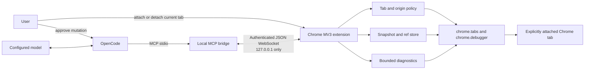
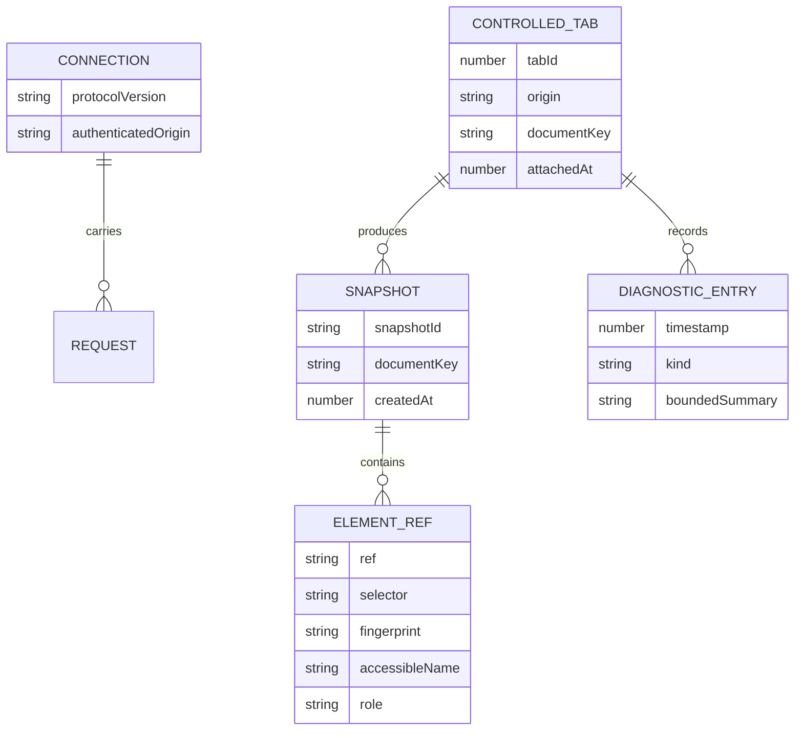
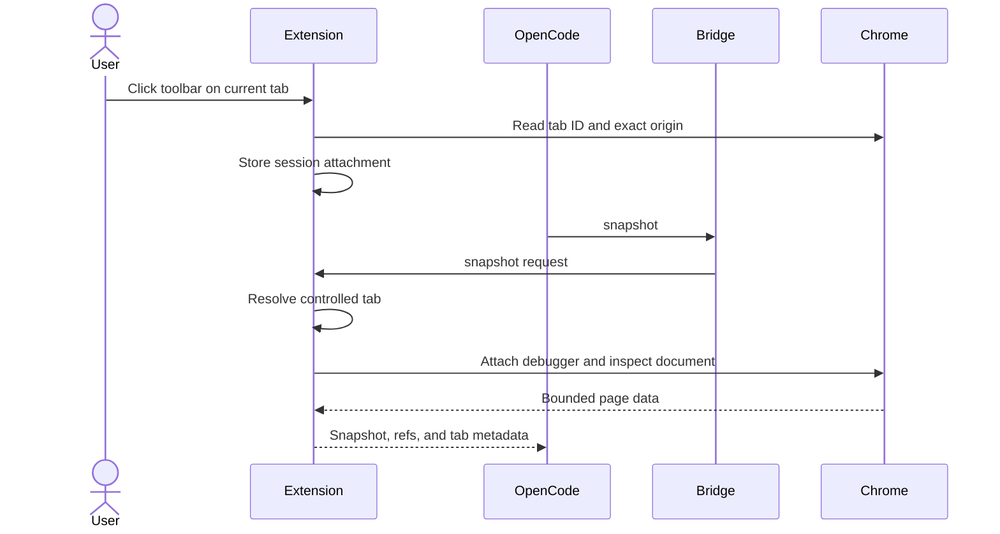
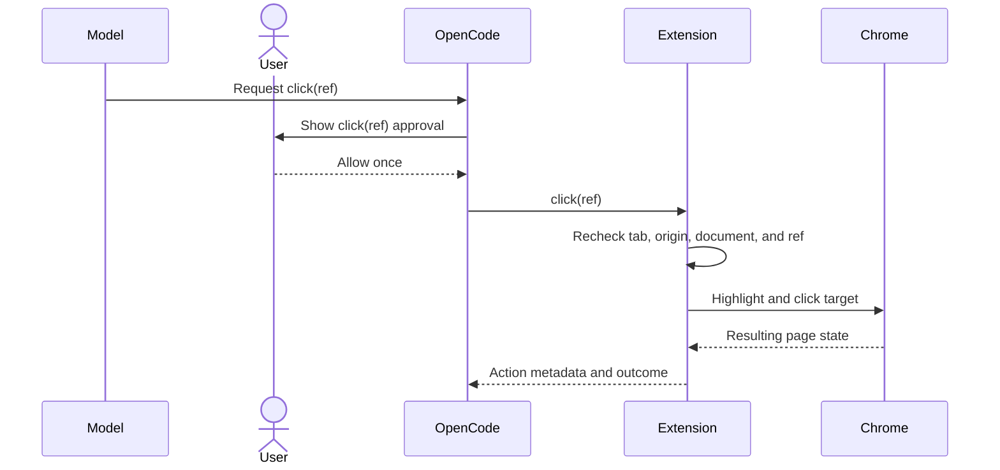

# opencode-chrome Architecture

Status: Proposed  
Target: v0.2  
Last updated: 2026-08-22

## Requirements summary

The system must let OpenCode operate an explicitly attached tab in the user's
normal Chrome profile. It must remain local, model-agnostic, dependency-light,
and usable without a backend or build service.

The main non-functional requirement is safety. Browser content is untrusted,
the selected tab may contain private data, and clicks or typing may create
real-world effects. The design therefore favors visible selection, explicit
approval, bounded output, and fail-closed identity checks over autonomy.

Constraints:

- Chrome Manifest V3 service worker;
- Node.js MCP server over stdio;
- localhost transport only;
- no extension build step;
- no new runtime dependency without a demonstrated need;
- tests must run without a real Chrome, with one small smoke suite for Chrome.

## Current architecture assessment

The repository is a small two-process adapter:

- `src/index.js` owns MCP stdio, the localhost WebSocket server, authentication,
  request correlation, timeouts, and result formatting.
- `src/tools.js` owns the MCP contract and Zod schemas.
- `extension/background.js` owns connection lifecycle, tab resolution, debugger
  attachment, CDP calls, snapshots, refs, and tool implementations.
- `extension/options.*` owns pairing-token configuration.

The shape is appropriate and should remain a modular monolith. The primary
problem is not service boundaries. It is that `extension/background.js` owns
several independent policies and the current implicit active-tab selection is
not a safe authorization boundary.

Current strengths:

- loopback-only transport plus a pairing token;
- small MCP surface;
- debugger auto-detach;
- navigation invalidates cached refs;
- refs are rechecked before click and type;
- deterministic bridge tests with a fake extension.

Current gaps:

- every open tab is addressable and the active tab is selected implicitly;
- no exact-origin attachment policy;
- stale-ref fingerprint is only element tag plus accessible name;
- mutations return no target or outcome metadata;
- no console or network diagnostic collection;
- bridge tests do not exercise extension policy or CDP behavior;
- the existing design document describes a ref implementation that differs
  from the code.

## Target system diagram



No browser content goes to a project backend. Tool results return through
OpenCode and may be sent to the model provider selected by the user.

## State ownership



- The extension owns controlled-tab authorization because it has the live tab
  URL and browser lifecycle events.
- The extension owns refs and diagnostics. Neither crosses a process restart as
  durable state.
- The bridge owns only request correlation, transport timeouts, and MCP result
  formatting.
- OpenCode owns the approval decision. The model cannot approve its own tool call.
- There is no database. The pairing token remains the only durable secret.

## Module boundaries

| Module | Responsibility | Owns state | Exposes |
|---|---|---|---|
| MCP contract | Tool names, descriptions, schemas, safe permission guidance | none | MCP tool definitions |
| Bridge transport | Loopback listener, token and exact fixed extension-origin authentication, correlation, timeout | pending requests | WebSocket request protocol |
| Extension lifecycle | WebSocket reconnect, protocol negotiation, badge, dispatcher | connection state | dispatch by tool name |
| Tab policy | Explicit attach/detach, exact-origin check, target resolution | controlled tabs | `resolveControlledTab` |
| Browser driver | Debugger lifecycle and bounded CDP operations | debugger sessions | semantic browser actions |
| Snapshot/ref store | Page representation, snapshot identity, ref revalidation | snapshots by tab | snapshot and resolve ref |
| Diagnostics | Redacted bounded console/network ring buffers | entries by tab | query and clear diagnostics |
| Options UI | Pairing token and safety guidance | token | Chrome options page |

These are ownership boundaries, not a requirement to create one file per row.
The first implementation should extract a module only when doing so makes the
policy independently testable or reduces the existing `background.js` hotspot.

## Contracts

### MCP to bridge

The existing JSON contract remains:

```json
{"id": 1, "tool": "snapshot", "args": {"tabId": 42}}
```

Success:

```json
{"id": 1, "result": {"snapshot": "...", "meta": {"tabId": 42, "url": "https://example.com"}}}
```

Failure:

```json
{"id": 1, "error": {"code": "TAB_NOT_ATTACHED", "message": "Attach this tab from the extension toolbar."}}
```

Errors use stable codes plus actionable messages. Unknown fields remain
forward-compatible. Protocol negotiation occurs before the bridge accepts tool
traffic; incompatible versions fail before any browser action.

### Tab policy

`resolveControlledTab(args)` is the shared seam for every tab-reading or
tab-mutating tool.

It must:

1. resolve an explicit `tabId` or the most recently attached tab;
2. load the current tab from Chrome;
3. parse its URL and allow only `http:` or `https:` targets supported by Chrome;
4. compare the exact current origin to the session attachment;
5. reject missing, closed, detached, restricted, or cross-origin tabs;
6. return normalized tab metadata used in the result and approval preview.

No tool may call `chrome.tabs`, `chrome.debugger`, or page evaluation around
this seam to avoid policy enforcement.

### Snapshot and refs

A snapshot receives an opaque `snapshotId` and a `documentKey` derived from
browser-observed document identity, not only the URL. Each ref stores:

- snapshot and document identity;
- structural selector;
- tag, role, accessible name, stable attributes, and bounds;
- a bounded fingerprint of those fields.

Before a mutation, the driver verifies the controlled tab, document identity,
selector resolution, fingerprint, and visibility. A mismatch returns
`STALE_REF`; it never silently refreshes or retries against another element.

### Approval boundary

OpenCode MCP permission keys are `<server>_<tool>`. The recommended config
allows inspection tools and asks for every mutation. The project must not tell
users to run browser workflows with `--auto`.

The browser bridge cannot reliably infer that arbitrary page controls are
semantically consequential. It provides precise action metadata; OpenCode
provides the human approval boundary; packaged instructions require final
actions to be isolated in their own call.

### Diagnostics

Console and network events are stored in fixed-size per-tab ring buffers.

Allowed network fields:

- timestamp;
- request URL after credential stripping;
- method;
- resource type;
- status;
- failure reason.

Request/response bodies, cookies, authorization headers, and raw headers are
not captured in v0.2. Console arguments are converted to bounded text and
truncated. Idle debugger teardown stops collection but keeps the bounded
buffers; state is deleted on explicit detach or tab close.

## Key flows

### Attach and inspect



### Approved mutation



## Architecture decisions

### ADR-001: Keep the local MCP plus MV3 extension architecture

- Status: Accepted.
- Context: The product must use OpenCode models and the user's real Chrome profile.
- Decision: Keep stdio MCP, a loopback WebSocket bridge, and an MV3 extension
  using `chrome.debugger`. Pin the unpacked extension ID with a manifest public
  key and require that exact WebSocket origin.
- Consequences: No backend or model lock-in. The debugger permission remains
  powerful and the MV3 service worker requires reconnect handling.
- Alternatives: Playwright-launched Chromium loses the desired session UX;
  Native Messaging adds installer and platform complexity not yet justified.

### ADR-002: Explicit tab attachment is the browser authorization boundary

- Status: Proposed.
- Context: Implicitly controlling whichever tab is active can expose unrelated
  accounts or act on a tab that changed after planning.
- Decision: The user attaches a tab through the toolbar; access is session-scoped
  to its exact origin and fails closed after cross-origin navigation.
- Consequences: One extra user click, materially smaller browser-data scope.
- Alternatives: Global domain allowlists remain useful later but do not identify
  the exact tab the user intended to share.

### ADR-003: Use OpenCode permissions for mutation HITL

- Status: Proposed.
- Context: Arbitrary websites do not expose a trustworthy universal commit boundary.
- Decision: Require `ask` for every mutation tool and isolate final actions into
  separate calls. Do not build a semantic danger classifier in v0.2.
- Consequences: More prompts, but each real action is visible and model-agnostic.
- Alternatives: An extension approval UI duplicates OpenCode and adds another
  state machine; heuristics can miss autosave and mislabeled controls.

### ADR-004: Keep a small semantic tool surface

- Status: Proposed.
- Context: Raw CDP and arbitrary JavaScript enlarge prompt-injection and data-loss
  impact and are difficult for humans to review.
- Decision: Expose bounded semantic actions and diagnostics only.
- Consequences: Some advanced debugging workflows remain unsupported.
- Alternatives: A 100-tool or raw-CDP surface can be added only behind a separate,
  explicitly enabled developer mode after measured demand.

### ADR-005: Capture diagnostic metadata, not payloads

- Status: Proposed.
- Context: Console and network data are essential for debugging but often contain
  secrets and personal data.
- Decision: Use bounded ring buffers and omit bodies, cookies, authorization, and
  raw headers.
- Consequences: Enough evidence for common frontend failures without becoming a
  traffic recorder. Payload inspection remains out of scope.

## Dependency analysis

Runtime dependencies remain:

- `@modelcontextprotocol/sdk` for MCP;
- `ws` for the local bridge;
- `zod` for tool input validation.

Chrome APIs and the Node.js standard library cover the target design. No
database, queue, hosted service, Playwright runtime, or new package is required.
There are no cross-package dependency cycles in the current repository.

## Risks and mitigations

| Risk | Impact | Likelihood | Mitigation |
|---|---|---:|---|
| Prompt injection causes an unintended action | High | High | Explicit tab attach, fresh refs, ask on every mutation, final action isolation |
| Private page data reaches an unsuitable model | High | Medium | Dedicated profile guidance, attached tabs only, bounded output, provider warning |
| Active tab changes between plan and action | High | Medium | Resolve attached tab ID, not current focus; recheck origin and document |
| Same-name replacement passes stale check | High | Medium | Stronger fingerprint and document-bound opaque refs |
| Diagnostics capture secrets | High | Medium | Metadata allowlist, body/header omission, bounds, clear on detach |
| Local process steals the pairing token | High | Low | Mode `0600`, loopback only, exact extension origin, document local threat model |
| MV3 suspends the service worker | Medium | High | Alarm-based reconnect, protocol handshake, idempotent state reconstruction |
| Debugger conflicts with DevTools | Medium | Medium | Actionable error and idle detach; no hidden retry loop |
| Tool surface expands without policy coverage | High | Medium | Every tool must route through the shared tab-policy seam and contract tests |

## Verification strategy

1. Pure unit tests for origin normalization, attachment state, ref fingerprints,
   redaction, and ring-buffer bounds.
2. Bridge contract tests with the existing fake extension.
3. Extension harness tests with mocked Chrome APIs for policy and lifecycle.
4. One real-Chrome smoke script for attach, snapshot, mutation, diagnostics,
   detach, and version mismatch.
5. Manual security review before release for authorization, page-data exposure,
   prompt injection, and consequential actions.
